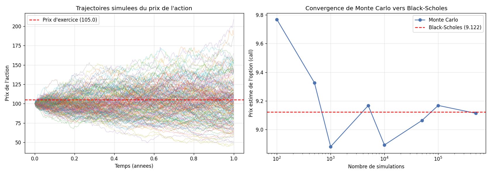

# option-pricing-black-scholes
Pricing d'options par Black-Scholes et Monte Carlo - grecques, convergence des méthode

Un modèle Python qui calcule le prix d'une option financière selon deux méthodes complémentaires, Black-Scholes et Monte Carlo, et vérifie qu'elles convergent vers le même résultat. C'est un problème central des salles de marchés et de la finance quantitative.

 Objectif

Une option est un contrat donnant le droit, mais pas l'obligation, d'acheter ou de vendre une action à un prix fixé, à une date future. La question centrale est de déterminer combien vaut ce droit aujourd'hui. Ce projet répond à cette question de deux façons et confronte les résultats, une démarche qui valide la robustesse du pricing.

 Les deux approches

La première est la formule de Black-Scholes, récompensée par un prix Nobel, qui donne le prix théorique exact d'une option européenne à partir du prix de l'action, du prix d'exercice, du temps restant, du taux sans risque et de la volatilité.

La seconde est la simulation de Monte Carlo. Plutôt que d'appliquer une formule, on simule des dizaines de milliers de trajectoires possibles du prix de l'action, on calcule le gain de l'option dans chaque scénario, puis on en prend la moyenne actualisée. Plus le nombre de simulations augmente, plus l'estimation converge vers le prix de Black-Scholes.

 Les grecques

Le modèle calcule également les principales sensibilités de l'option, appelées les grecques. Le Delta mesure la variation du prix de l'option quand l'action bouge, le Vega sa sensibilité à la volatilité et le Theta la perte de valeur liée au temps qui passe. Ce sont les outils quotidiens d'un trader pour gérer et couvrir ses positions.

 Résultats

Pour une option call de référence, Black-Scholes donne un prix de 9.12 et Monte Carlo un prix de 9.15, soit un écart inférieur à 0.03. Cette concordance entre une formule fermée et une simulation indépendante confirme la justesse du modèle.



Le graphique de gauche montre les trajectoires simulées du prix de l'action jusqu'à l'échéance, illustrant l'incertitude sur le prix futur. Celui de droite montre comment l'estimation de Monte Carlo converge vers la valeur de Black-Scholes à mesure que le nombre de simulations augmente.

 Concepts appliqués

Options call et put, formule de Black-Scholes, simulation de Monte Carlo, mouvement brownien géométrique, volatilité, actualisation, et les grecques (Delta, Vega, Theta).

 Technologies

Python 3, avec NumPy pour les calculs et les simulations, SciPy pour la loi normale et Matplotlib pour la visualisation.

 Comment lancer

```
pip install numpy scipy matplotlib
python option_pricing.py
```

Le programme affiche les résultats en console et génère l'image option_pricing_resultats.png.

Projet réalisé dans le cadre de mon parcours en Finance (M1, ENCG Fès).
